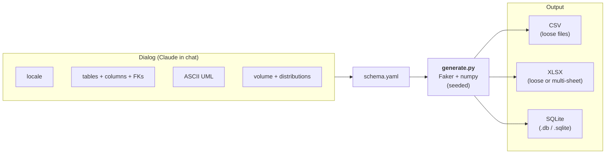

# Syntherklaas: interactive synthetic data generator

<p align="center">
  
</p>

Real data is the fastest way to prototype.<br>
GDPR is the fastest way to get blocked.

`syntherklaas` skips the input data step entirely: instead of feeding it a production export to anonymize, you have a short conversation with it about the shape of the data you want — tables, columns, foreign keys, volumes, distributions — and it generates a coherent synthetic dataset from scratch with [Faker](https://github.com/joke2k/faker) (locale-aware) plus NL-locked providers for BSN (11-proof), IBAN (mod-97), postcode, and phone formats.

Packaged as a [Claude Code](https://claude.ai/code) skill: the dialog runs in chat, the schema is captured as a YAML, and a small Python generator turns that YAML into CSV, XLSX, or SQLite output.



## How it works

1. **Dialog** — Claude asks about each table (paste examples or define columns together), per-column provider, FK relations, then volume + distributions per table and per column. After all tables are defined, Claude renders an ASCII UML diagram with cardinality.
2. **Schema-YAML** — Claude writes the captured choices to `/tmp/syntherklaas-<sessid>/schema.yaml` (see [`examples/demo-schema.yaml`](skills/engineering/syntherklaas/examples/demo-schema.yaml) for the format).
3. **Preview** — `generate.py --schema <yaml> --preview` runs the pipeline and prints 10 rows per table as JSON. Claude renders the preview in chat.
4. **Output** — user picks `csv-loose` / `xlsx-loose` / `xlsx-multi` / `sqlite`; `generate.py --schema <yaml> --output <path> --format <fmt>` writes the data.
5. **Save schema (optional)** — Claude offers to copy the YAML to a user-chosen path. Next time, `/syntherklaas <path>` skips the dialog: load YAML → show summary + preview → 1× confirmation → run.

## Installation

> Only tested with [Claude Code](https://claude.ai/code).

```bash
npx skills@latest add baswenneker/syntherklaas
```

Restart Claude Code (or open a new session). The skill registers via `.claude-plugin/plugin.json`.

## Skills

| Category | Skill | Description |
| --- | --- | --- |
| engineering | [syntherklaas](skills/engineering/syntherklaas/SKILL.md) | Interactive synthetic data generator. Builds a data model through dialog, generates with Faker + NL extras, outputs CSV/XLSX/SQLite. Saved schemas re-run with one confirmation. |

## How to invoke

From Claude Code:

```
/syntherklaas
```

…starts the full dialog. Or pass a saved schema YAML to skip the dialog:

```
/syntherklaas ./demo-schema.yaml
```

## Try it on the bundled example

A 3-tier schema (klanten / orders / orderlines) with FKs, distributions, and categorical weights lives in [`skills/engineering/syntherklaas/examples/demo-schema.yaml`](skills/engineering/syntherklaas/examples/demo-schema.yaml).

Run it directly:

```bash
bash skills/engineering/syntherklaas/scripts/run.sh \
  --schema skills/engineering/syntherklaas/examples/demo-schema.yaml \
  --preview
```

Or generate the full SQLite output (the YAML already declares `output.format: sqlite` and `output.path: ./demo.db`):

```bash
bash skills/engineering/syntherklaas/scripts/run.sh \
  --schema skills/engineering/syntherklaas/examples/demo-schema.yaml
```

A sample of `klanten` after the run:

```
$ sqlite3 -header -column ./demo.db \
    "SELECT id, naam, bsn, postcode, leeftijd FROM klanten LIMIT 5"

id  naam                              bsn        postcode  leeftijd
--  --------------------------------  ---------  --------  --------
1   Ali Schellekens                   391171823  4471 VH         47
2   Finn Jansdr-Goyaerts van Waderle  278248962  4936 DR         26
3   Melle van Brenen                  383465783  3242 CB         53
4   Amin Gellemeyer                   839301030  2499 JO         56
5   Floris van de Elzas-Blonk         105183477  1746 IQ         18
```

BSNs pass the 11-proof checksum, postcodes match `1234 XX`, phone numbers are 06-format, and `orders.klant_id` is guaranteed to reference an existing `klanten.id`.

Walk through a full session transcript at [`skills/engineering/syntherklaas/examples/transcript.md`](skills/engineering/syntherklaas/examples/transcript.md).

## Schema-YAML format

```yaml
version: 1
locale: nl_NL          # default; any Faker locale (en_US, de_DE, ...)
seed: 42               # optional; otherwise SHA256(schema)[:8] as int

output:                # optional; preset for re-invoke
  format: sqlite       # csv-loose | xlsx-loose | xlsx-multi | sqlite
  path: ./demo.db

tables:
  - name: users
    columns:
      - { name: id,    provider: sequential, primary_key: true }
      - { name: naam,  provider: faker.name }
      - { name: bsn,   provider: nl.bsn,    unique: true }
      - { name: email, provider: faker.email }
      - name: leeftijd
        provider: numeric_range
        type: int
        min: 18
        max: 80
        distribution: normal
        mean: 42
        stddev: 15
      - name: status
        provider: categorical
        choices: [active, inactive, suspended]
        weights: [0.8, 0.15, 0.05]
    volume:
      count: { distribution: fixed, value: 100 }

  - name: events
    columns:
      - { name: id,        provider: sequential, primary_key: true }
      - { name: user_id,   provider: fk, references: users.id }
      - name: occurred_at
        provider: datetime_range
        start: "2024-01-01"
        end:   "2024-12-31"
        distribution: uniform
    volume:
      per_parent:
        parent: users
        distribution: poisson
        lambda: 20
        min: 1
```

## Providers

| Provider                | Locale-aware? | What it emits                                    |
|-------------------------|:-------------:|---------------------------------------------------|
| `sequential`            | n.v.t.        | Auto-increment int (PK)                           |
| `fk`                    | n.v.t.        | Random pick from a parent table's ID column       |
| `faker.<method>`        | ✅            | Any callable on a `Faker` instance — `name`, `email`, `address`, `phone_number`, `company`, `text`, ... |
| `nl.bsn`                | ❌ NL-locked  | 11-proof BSN                                      |
| `nl.iban`               | ❌ NL-locked  | NL IBAN with mod-97 checksum                      |
| `nl.postcode`           | ❌ NL-locked  | `1234 AB`                                         |
| `nl.phone`              | ❌ NL-locked  | `06-XXXXXXXX`                                     |
| `nl.tussenvoegsel`      | ❌ NL-locked  | Surname-infix (`van der`, `de`, ...)              |
| `numeric_range`         | n.v.t.        | int/float; distributions: `uniform`, `normal`, `lognormal`, `exponential` |
| `categorical`           | n.v.t.        | Choice with optional weights                      |
| `datetime_range`        | n.v.t.        | Datetime in `[start, end]`; `uniform` or `normal` |

## Output formats

| Format       | `--output` is...         | Notes                                                  |
|--------------|--------------------------|--------------------------------------------------------|
| `csv-loose`  | a (new/empty) directory  | One `<table>.csv` per table                            |
| `xlsx-loose` | a (new/empty) directory  | One `<table>.xlsx` per table; per-sheet row limit applies |
| `xlsx-multi` | a (new) `.xlsx` file     | One multi-sheet workbook; topological sheet order; frozen header |
| `sqlite`     | a (new) `.db`/`.sqlite`  | Bulk insert; no FK constraints in DDL (FKs are correct by construction) |

No append modes. The output target must be free (file: doesn't exist; directory: empty or doesn't exist).

## Exit codes

- `0` — success
- `2` — schema/output/format problem (malformed YAML, unknown provider, FK to unknown column, output already exists, Excel row/sheet-name limit exceeded, ...)
- `3` — cyclic FK detected
- `4` — missing `uv` on PATH

## Tests

```bash
cd skills/engineering/syntherklaas/scripts
uv sync
uv run pytest
```

Unit tests cover providers + validators (BSN 11-proof, NL IBAN mod-97, NL postcode/phone pattern), distributions (statistical mean/range checks on 1k–10k samples), schema validation (happy paths + every error branch), generation (rowcounts, FK integrity, determinism), writers (round-trip per format, output-exists guards, Excel limits).

## Standalone CLI (without Claude Code)

```bash
cd skills/engineering/syntherklaas/scripts
uv sync

# Preview-only (JSON to stdout)
uv run python generate.py --schema <yaml-path> --preview

# Write
uv run python generate.py --schema <yaml-path> --output ./out.db --format sqlite
```

The same `bash run.sh` wrapper handles the first-run `uv sync`; pass any of the flags through.

## Adding more skills to this plugin

1. Create `skills/<category>/<skill-name>/SKILL.md` (YAML frontmatter `name`, `description`, plus a markdown body).
2. Bash helpers go in a sibling `scripts/` subfolder.
3. Register the skill folder in `.claude-plugin/plugin.json` under `skills`.
4. Add a row to the table above.

See [CLAUDE.md](CLAUDE.md) for repo conventions and [CONTEXT.md](CONTEXT.md) for shared vocabulary.

## Related

- [joke2k/faker](https://github.com/joke2k/faker) — fake data generation; used here locale-aware (`nl_NL` default).
- [baswenneker/fwd-skills](https://github.com/baswenneker/fwd-skills) — sibling skills plugin from which this repo borrows layout conventions.
- [mattpocock/skills](https://github.com/mattpocock/skills/tree/main) — the `skills` CLI used for installation and the layout pattern this repo follows.
